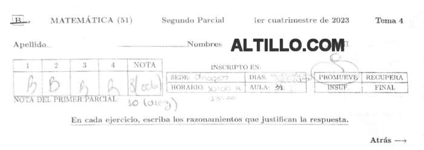
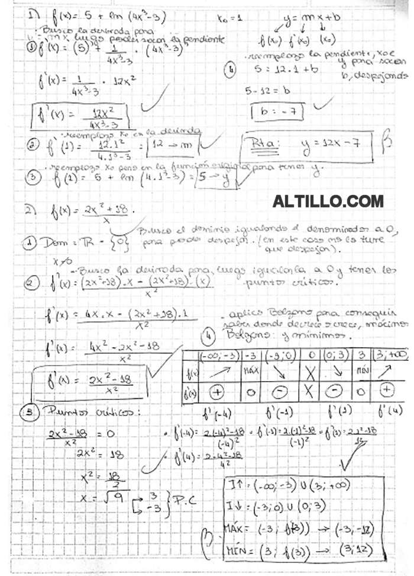

# Assignment 

# Answers

# Translation

1. Find the equation of the tangent line to the graph of f(x) = 5 + ln(4x^3 - 3) at the abscissa (x-coordinate) point x0 = 1
2. Let f(x) = (2x^2 + 18)/x. Determine the domain, the intervals of increase and decrease, and the local extremes of f.
3. Calculate ∫3x^2√(x^3 + 10)dx
4. Find the area of the region enclosed by the graph of f(x) = x^2 - 5x and the x axis.

# My Thoughts

### Question 1: Tangent line of a function

- Find the equation of the tangent line to the graph of f(x) = 5 + ln(4x^3 - 3) at the abscissa (x-coordinate) point x0 = 1.
  - The importance of the tangent line is that it represents the derivative at a particular point of the function.
  - Derivative: The derivative at a given point is defined as the limit of the average rate of change at that particular point. It's the slope of the tangent line of that point.
  - To find the derivative equation, we'll need to apply some of the **Rules of Differentiation** to the original function and point of interest.
  - 

### Question 1: Rules of Differentiation

1. **Rules of Differentiation**:
   Differentiation rules are used to find the derivatives of functions. Some of the fundamental rules include:
   - **Power Rule**: If you have a term in the form (x^n), the derivative is (nx^{n-1}).
   - **Sum/Difference Rule**: If you have a sum or difference of functions, you can find the derivative of each term separately.
   - **Product Rule**: If you have the product of two functions, the derivative is the first function times the derivative of the second plus the second function times the derivative of the first.
   - **Quotient Rule**: If you have the quotient of two functions, the derivative is (derivative of the numerator times denominator) minus (numerator times derivative of the denominator) divided by (denominator squared).
   - **Chain Rule**: For composite functions, you can find the derivative by taking the derivative of the outer function times the derivative of the inner function.
   - **Exponential and Logarithmic Rules**: Derivatives of exponential functions like (e^x) and logarithmic functions like (ln(x)) follow specific rules.
   - **Constant Rule**: The rule states that the derivative of a constant, such as the number 5, is always zero. In mathematical notation, if c is a constant, then the derivative of c with respect to x is 0.
   
   To find the derivative of the original equation, you apply these rules based on the function's composition. For example, if you have (f(x) = 5 + ln(4x^3 - 3)), you can use the power rule for (ln(4x^3 - 3)), the constant rule for 5, and then apply the sum rule.

2. **Finding Points on the Tangent Line**:
   To find points on the tangent line, you need to understand that a line is defined by its slope and a single point on the line. Once you have the derivative (the slope) and a specific point ((x_0, y_0)) on the original function, you can find the equation of the tangent line.

   - The slope of the tangent line is given by the derivative (f'(x_0)) at the point (x_0). This slope represents the rate of change of the function at that point.
   - To find another point on the tangent line, you can use the point-slope form of a line: (y - y_0 = m(x - x_0)), where (m) is the slope and ((x_0, y_0)) is the given point.
   - Substitute the known values: (y - y_0 = f'(x_0)(x - x_0)). Now, you have the equation of the tangent line.
   - You can use this equation to find points on the tangent line by choosing different (x) values. Plug in different (x) values into the equation to find the corresponding (y) values on the tangent line.

This process allows you to construct the tangent line by determining how it behaves based on its slope and a single point. By choosing different (x) values and applying the equation, you can find points on the tangent line to compare with the original function at (x_0).

### Question 1: The plot of the derivative differs from the plot of the tangent line**:
- The shape of the derivative at a particular point is related to the slope of the tangent line at that point, but they are not the same. Here's the distinction:

1. **Derivative at a Point (Instantaneous Rate of Change):** The derivative at a specific point represents the rate of change of the function at that point. In other words, it shows how fast the function is increasing or decreasing at that point. The value of the derivative indicates the slope of the tangent line to the function at that specific point. If the derivative is zero, it means the function is relatively flat at that point.

2. **Tangent Line at a Point:** The tangent line to a function at a particular point is a straight line that touches the curve of the function at that point without crossing it. The slope of the tangent line at that point is equal to the value of the derivative at that point. This means that the derivative provides the slope of the tangent line, but the tangent line is a linear approximation of the function's behavior near that point.

So, while the derivative and the tangent line are related in that they both involve slopes, the derivative is a function itself (it can vary along the x-axis), while the tangent line is a straight line that approximates the function's behavior at one specific point. The derivative provides information about how the tangent line's slope changes as you move along the x-axis.

For linear functions, the tangent line is a constant, straight line, which means the derivative (rate of change) is also constant. However, for non-linear functions, the tangent line's slope (as represented by the derivative) can vary significantly.